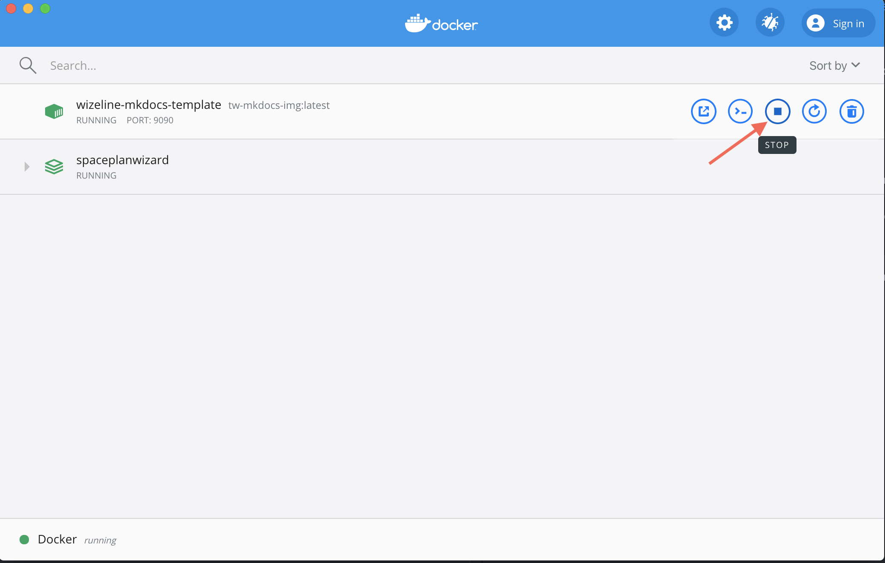
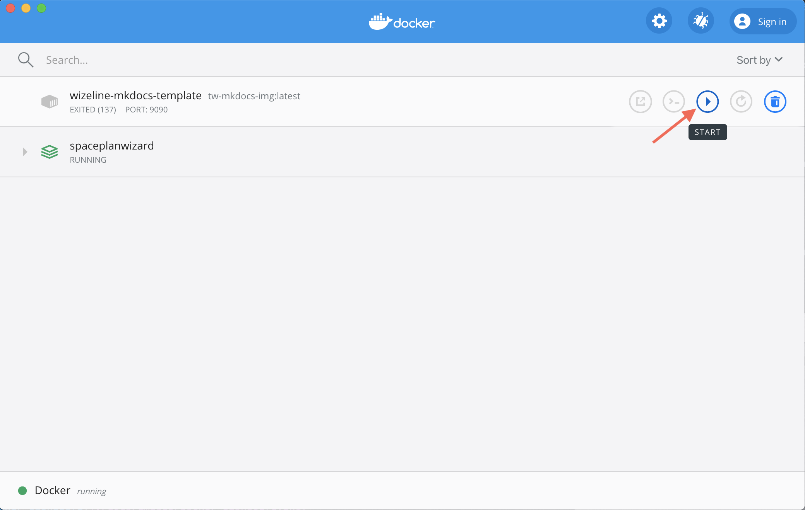

# tw-mkdocs

## Installation

1. Install docker desktop from https://hub.docker.com/editions/community/docker-ce-desktop-mac
2. Change directory to the tw-mkdocs folder
```
cd path/to/project/tw-docops/tw-mkdocs
```
3. Build mkdocs image.

Execute the following command in the terminal using the current directory
```
docker build -t tw-mkdocs-img .
```
4. Serve your local environment.

Execute the following command in the terminal after the docker image creation.
```
docker run --name wizeline-mkdocs-template -p 9090:9090 --volume="$PWD:/app" tw-mkdocs-img:latest
```

>**Note:** Use the `-d` flag in the above command to detach your terminal from the running container.

5. Start working. Open http://localhost:9090 to see all your changes.

## Stop mkdocs

Open docker's dashboard


Locate the wizeline-mkdocs-template container and stop it



Wait until the terminal process stops

## Restart mkdocs

Open docker's dashboard


Locate the wizeline-mkdocs-template container and start it



## Create static site
1. Change directory to the tw-mkdocs folder

2. Execute the following command
```
docker run --rm --volume="$PWD:/app" -it tw-mkdocs-img:latest mkdocs build
```
