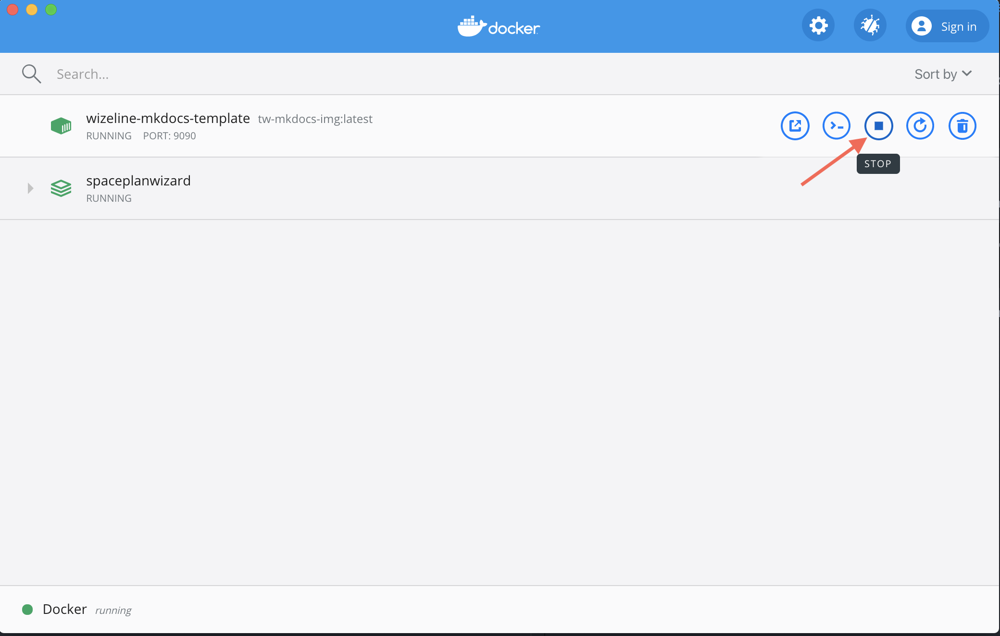
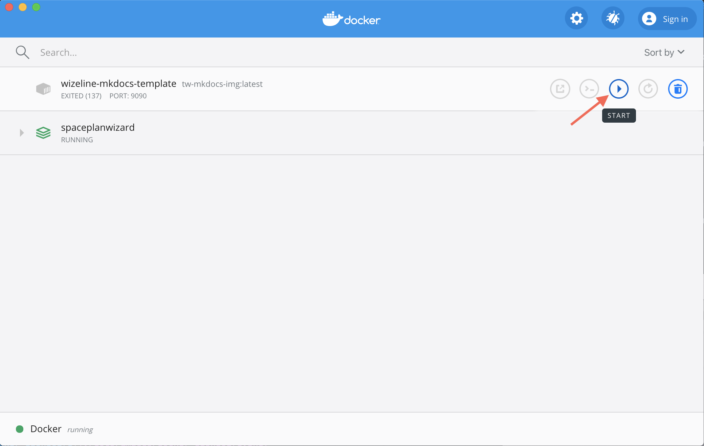

# tw-slate

## Installation

1. Install docker desktop from https://hub.docker.com/editions/community/docker-ce-desktop-mac
2. Change directory to the tw-slate folder
```
cd path/to/project/tw-docops/tw-slate
```
3. Execute the following command in the terminal to pull the most recent slate image from Docker Hub.
    **Note**: This is a one-time action and takes a few minutes to finish.
```
docker pull slatedocs/slate
```
4. Execute the following command in the terminal after the docker image creation to serve your local environment:
```
docker run --name wizeline-slate-preview -p 4567:4567 --volume="$(pwd)/source:/srv/slate/source" slatedocs/slate serve
```

>**Note:** Use the `-d` flag in the above command to detach your terminal from the running container.

5. Start working. Open http://localhost:4567 to see all your changes.

## Stop Slate Container

1. Open docker's dashboard


2. Locate the `wizeline-slate-template` container and stop it.



3. Wait until the terminal process stops

## Restart Slate

1. Open docker's dashboard


2. Locate the wizeline-slate-template container and start it.



## Create static site
1. Change directory to the tw-slate folder

2. Execute the following command:
```
docker run --rm --name wizeline-slate-build -v $(pwd)/build:/srv/slate/build -v $(pwd)/source:/srv/slate/source slatedocs/slate
```
